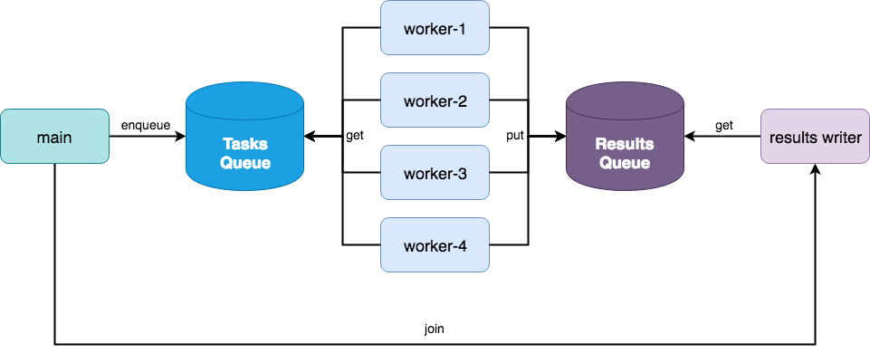

.. -*- mode: rst -*-

Multiprocessing
===============

.. warning::

    If using btrdb-python with multiprocessing, you must fork (e.g. start your workers)
    before creating a connection to the database, otherwise the gRPC connection will
    hang. See: https://github.com/grpc/grpc/issues/15334 for details.

Complex analytics in Python may require additional speedups that can be gained by using the Python multiprocessing library. Other libraries like web applications take advantage of multiprocessing to serve a large number of users. Because btrdb-python uses `grpc <https://grpc.io/docs/tutorials/basic/python.html>`_ under the hood, it is important to understand how to connect and reuse connections to the database in a multiprocess or multithread context.

The first and most critical thing to note is that ``btrdb.Connection`` objects *are not thread- or multiprocess-safe*. This means that in your code you should use either a lock or a semaphore to share a single connection object or that each process or thread should create their own connection object and clean up after themselves when they are done using the connection. Moreover, because of the forking issue discribed in the warning above, you must also take care when to create connections in worker processes.

Let's take the following simple example: we want to perform a data quality analysis on 12 hour chunks of data for all the streams in our ``staging/sensors`` collection. If we have hundreds of sensor streams across many months, this job can be sped up dramatically by using multiprocessing. To do this, let's consider the following process architecture:

At first glance, this architecture looks similar to the one used by ``multiprocessing.Pool``, which is true. However, consider the following code:

.. code-block:: python

    import json
    import math
    import btrdb
    import multiprocessing as mp

    from btrdb.utils.timez import ns_delta

    # This is just an example method
    from qa import data_quality

    def time_ranges(stream):
        """
        Returns all 12 hour time ranges for the given stream
        """
        earliest = stream.earliest()[0].time
        latest = stream.latest()[0].time
        hours = int(math.ceil((latest-earliest)/3.6e12))

        for i in range(0, hours, 12):
            start = earliest + ns_delta(hours=i)
            end = start + ns_delta(hours=12)
            yield start, end

    def stream_quality(uuid):
        """
        Connects to BTrDB and applies the data quality to 12 hour chunks
        """
        # Connect to DB and get the stream and version
        db = btrdb.connect()
        stream = db.stream_from_uuid(uuid)
        version = stream.version()

        # Get the data quality scores for each 12 hour chunk of data
        quality = []
        for start, end in time_ranges(stream):
            values = stream.values(start=start, end=end, version=version)
            quality.append(data_quality(values))

        # Return the quality scores
        return json.dumps({"uuid": uuid, "version": version, "quality": quality})

    if __name__ == "__main__":
        # Get the list of streams to get scores for
        db = btrdb.connect()
        streams = db.streams_in_collection("staging/sensors")

        # Create the multiprocessing pool and execute the analytic
        pool = mp.Pool(processes=mp.cpu_count())

        for result in pool.imap_unordered(stream_quality, [s.uuid for s in streams]):
            print(result)

Let's break this down quickly since this is a very common design pattern. First the ``time_ranges`` function gets the earliest and latest timestamp from a stream, then returns all 12 hour intervals between those two timestamps with no overlap. An imaginary ``stream_quality`` function takes a uuid for a stream, connects to the database and then applies the example ``data_quality`` method to all 12 hour chunks of data using the ``time_ranges`` method, returning a JSON string with the results.

We expect the ``stream_quality`` function to be our parallelizable function (e.g. computing the data quality for multiple streams at a time). Depending on how long the ``data_quality`` function takes to compute we may also want to parallelize ``(stream, start, end)`` tuples. It seems that the ``multiprocessing.Pool`` would be perfect for this.

The problem, however, occurs because in order to get the UUIDs of the streams to queue to the ``Pool``, we must first connect to the database and perform a search on the specified collection. This connection appears before the fork (which occurs when ``imap_unordered`` is called) and therefore gRPC fails. Unfortunately this means we have to be a bit more verbose.

The solution is to create a custom worker that connects to BTrDB after the fork. Unfortunately, at the time of this writing there is no way to pass a custom worker to the ``Pool`` object. The worker is as follows:

.. code-block:: python

    class Worker(mp.Process):

        def __init__(self, host, apikey, handler, tasks, results):
            self.host = host
            self.apikey = apikey
            self.handler = handler
            self.tasks = tasks
            self.results = results

            self.db = None
            super(Worker, self).__init__()

        def connect(self):
            self.db = btrdb.connect(self.host, apikey=self.apikey)

        def run(self):
            # connect when started to ensure connection is in the fork
            self.connect()

            while True:
                task = self.tasks.get()
                if task is None:
                    # poison pill means shutdown
                    return

                try:
                    # Pass the task to the handler
                    result = self.handler(task)
                except Exception as e:
                    # Send any exceptions back to main process
                    result = {"task": task, "error": str(e)}

                self.results.put_nowait(result)

This simple worker process accepts BTrDB connection arguments, the URL and API key to connect to the database as well as a handler function and tasks and resuls queues. It only connects to the database on ``run()``, ensuring that the connection occurs after the fork. Then it simply reads off the task queue, executing the task and putting the results (or exceptions) on the results queue. If it gets ``None`` from the tasks queue, it shuts down.

We can change our multiprocessing method to use this new worker and connect after fork as follows:

.. code-block:: python

    if __name__ == "__main__":

        # BTrDB connection credentials
        HOST = "sensors.predictivegrid.com"
        APIKEY = "mysupersecretkey"

        # Tasks and results queues
        tasks, results = mp.Queue(), mp.Queue()

        # Create the workers with credentials and queues
        workers = [
            Worker(HOST, APIKEY, stream_quality, tasks, results)
            for _ in range(mp.cpu_count())
        ]

        # Start the workers, this is where the fork occurs
        for worker in workers:
            worker.start()

        # Now we can connect to the database and enqueue the streams
        n_tasks = 0
        db = btrdb.connect(HOST, apikey=APIKEY)
        for stream in db.streams_in_collection("staging/sensors"):
            tasks.put_nowait(stream.uuid)
            n_tasks += 1

        # Enqueue the poison pill to shut the workers down
        for _ in range(len(workers)):
            tasks.put_nowait(None)

        # Begin reading off of the results queue
        for _ in range(n_tasks):
            print(results.get())

        # Join on the workers to ensure they clean up
        for worker in workers:
            worker.join()

This method is certainly a lot more verbose than using `mp.Pool`, but unfortunately is the only work around to the forking issue that exists in BTrDB. If you would like features like a connection pool object (as other databases have) or multiprocessing helpers, please leave us a note in our GitHub issues!
